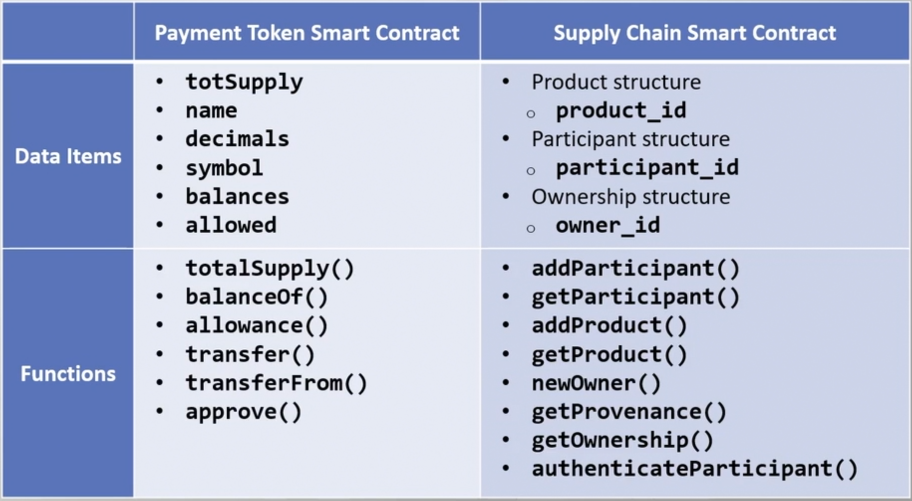

## A full blockchain supply chain solution
This project aims to solve all the traceability and payment issues that usually happen during any standard supply chain implementations with the help of the Ethereum blockchain and its own token. This dapp works as a framework that connects producers and consumers and manages products and services along that journey. This way, we can reduce the cost of all the middlemen in the process and offer more transparency and visibility.

## What is a Supply Chain?
A supply chain is a network of individuals and companies who are involved in creating a product and delivering it to the consumer. Links on the chain begin with the producers of the raw materials and end when the van delivers the finished product to the end user. Supply chain management is crucial because an optimized supply chain results in lower costs and a more efficient production cycle. Companies seek to improve their supply chains to reduce costs and remain competitive.

### Key takeaways:
- A supply chain is a network of companies and people involved in producing and delivering a product or service.
- The components of a supply chain include producers, vendors, warehouses, transportation companies, distribution centers, and retailers.
- The functions of a supply chain include product development, marketing, operations, distribution, finance, and customer service.
- Today, many supply chains are global in scale.
- Effective supply chain management results in lower costs and a faster production cycle.

## How does this solution work?
Every product works as an NFT, and every NFT has an owner who we can trace. Every time a change of ownership occurs, we can know where the product is and with who along the way, tracking every event from the beginning until the destination, so the consumer will be our last owner. Also, the participants can pay each other with a token bound to the solution.

## What about the tokens used in this supply chain?
In order to make all the payments, this solution has its own token called SupplyCoin, which is an ERC20 token that complies with the whole [standard defined by OpenZeppeling](https://docs.openzeppelin.com/contracts/2.x/erc20) with all the functionalities that any other coin in the market has.

### Is blockchain better than me?
Well, I don't know you, but yes.